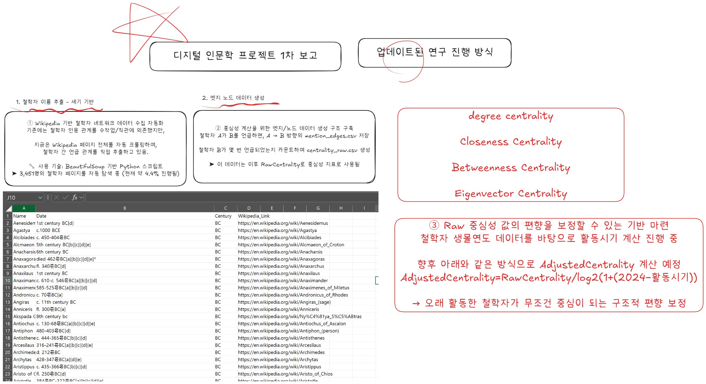

# 디지털 인문학 프로젝트 1차 진행보고서

## 프로젝트 개요

본 프로젝트는 Wikipedia 데이터를 활용하여 철학자 간의 인용 네트워크를 구축하고, 중심성 분석을 통해 각 철학자의 영향력을 정량적으로 규명하는 디지털 인문학 연구입니다. 1차 진행보고에서는 철학자 이름 추출, 인용 관계 데이터 수집 및 Raw 중심성 지표(언급 횟수 기반) 계산까지의 진행 상황을 다룹니다.

## 프로젝트 흐름도



## 파일 및 폴더 구조

현재 1차 진행보고 관련 파일 및 폴더 구조는 다음과 같습니다.

```
./
├── data/
│   ├── checkpoints/       # 데이터 수집 중간 저장 파일
│   └── processed/         # 전처리 및 분석 결과 데이터
│       ├── centrality_raw.csv # Raw 중심성 계산 결과 (언급 횟수)
│       └── mention_edges.csv # 철학자 간 언급 관계 (엣지) 데이터
│   └── raw/               # 초기 수집 원본 데이터
│       └── philosophers_by_century.csv # 철학자 이름, 생몰연도, 위키링크 데이터
├── src/                   # 소스 코드
│   ├── 01_namelist.py       # 철학자 목록 (이름, 생몰연도, 위키링크) 수집 스크립트
│   └── 02_search_name_from_wiki.py # 철학자 간 언급 관계 (엣지) 데이터 수집 및 Raw 중심성 계산 스크립트
└── README.md              # 프로젝트 개요 및 파일 구조 (현재 파일)
```

## 1차 진행 상황 보고

이번 1차 진행보고에서는 철학자 네트워크 구축을 위한 핵심 데이터 수집 단계와 초기 중심성 계산 결과를 공유합니다.

### 1. 철학자 이름 추출 및 생몰연도 데이터 수집

- **스크립트**: `src/01_namelist.py`
- **설명**: Wikipedia의 세기별 철학자 목록 페이지를 Beautiful Soup 기반 Python 스크립트를 사용하여 크롤링했습니다. 약 3,451명의 철학자 이름, 생몰연대, Wikipedia 링크 정보가 수집되어 `data/raw/philosophers_by_century.csv` 파일로 저장되었습니다. 이 데이터는 향후 Raw 중심성 값의 편향 보정(활동 시기)에 활용될 예정입니다.

### 2. 철학자 간 언급 관계 (엣지) 데이터 수집 및 Raw 중심성 계산

- **스크립트**: `src/02_search_name_from_wiki.py`
- **설명**: 수집된 철학자 목록을 바탕으로 각 철학자의 Wikipedia 페이지 본문을 분석하여 페이지 내에서 언급된 다른 철학자들을 식별했습니다. 이를 통해 '인용하는 철학자 → 인용되는 철학자' 형태의 방향성 네트워크 엣지를 구축했습니다.
  - **언급 횟수 (`RawCentrality`) 계산**: 각 철학자가 다른 철학자 페이지에서 총 몇 번 언급되었는지 카운트하여 `RawCentrality` 지표를 산출했습니다. 이 결과는 `data/processed/centrality_raw.csv` 파일로 저장되었습니다.
  - **엣지 데이터 저장**: 철학자 간 언급 관계는 `data/processed/mention_edges.csv` 파일로 저장되었습니다.
  - **기술적 특징**: Wikipedia 서버 과부하 방지를 위한 대기 시간 적용, 중간 결과 저장을 위한 체크포인트 기능(data/checkpoints/centrality*raw_checkpoint*_.csv 및 mention*edges_checkpoint*_.csv)이 구현되었습니다.

### 3. 향후 계획: Raw 중심성 값 편향 보정 및 상세 분석

- **현재 진행 중**: Raw 중심성 값은 단순히 언급 횟수에 기반하므로, 오래 활동한 철학자가 유리할 수 있는 구조적 편향이 존재합니다. 이를 보정하기 위해 철학자의 활동 시기를 고려한 `AdjustedCentrality` 계산을 준비 중입니다.
- **계산 예정 공식**: `AdjustedCentrality = In-DegreeCentrality / log2(1+(2024-활동시기))`
- **다음 단계**: 조정된 중심성 지표를 활용하여 네트워크의 Degree Centrality, Closeness Centrality, Betweenness Centrality, Eigenvector Centrality 등을 포함한 다양한 중심성 분석을 진행하고, 시각화 작업을 수행할 예정입니다.
