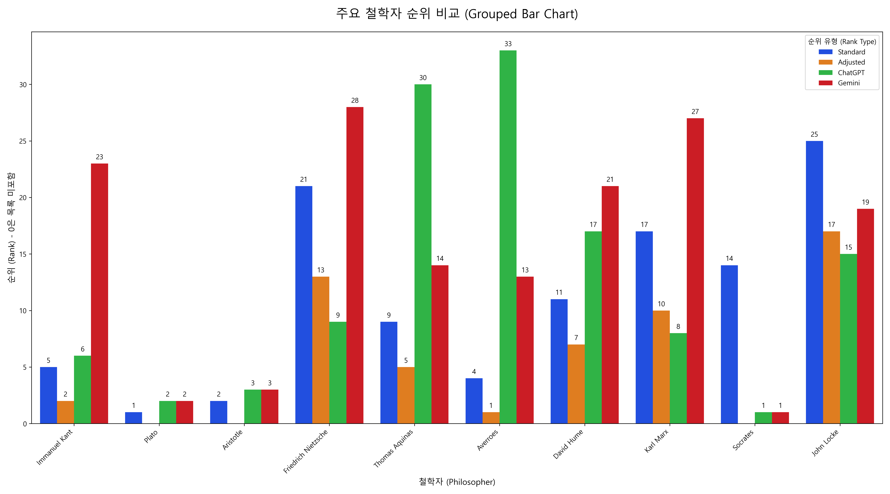

# 네트워크 분석과 AI 평가를 통한 철학자 지적 영향력 다각도 분석

---

## 초록 (Abstract)

본 연구는 위키피디아 데이터를 활용한 네트워크 분석을 통해 철학자들의 지적 영향력을 계량적으로 측정하고, 이를 다각도에서 비교 분석하는 것을 목표로 한다. 전통적인 영향력 지표인 '내차수 중심성(In-Degree Centrality)'과 함께, 철학자의 활동 시기를 보정하여 현대적 영향력을 파악하고자 '시간 보정 중심성(Adjusted In-Degree Centrality)'이라는 새로운 지표를 도입했다. 분석 과정에서 데이터의 신뢰도를 높이기 위해 이름 표기법 표준화, 인코딩 오류 해결 등 체계적인 데이터 정제 과정을 거쳤다. 분석 결과, 시간 보정 중심성은 고전 철학의 근원적 중요성과 현대 사상에 미치는 실질적 영향력을 구분하여 평가하는 데 효과적임을 확인했다. 또한, 데이터 기반 순위와 최신 AI 모델(ChatGPT, Gemini)이 평가한 순위를 비교 분석한 결과, 데이터 기반 분석은 학술적 연결성에 기반한 객관적 영향력을 드러내는 반면, AI 평가는 대중적 인지도와 문화적 맥락이 반영된 확장된 관점을 보여주었다. 본 연구는 단일한 평가 기준을 넘어, 다양한 렌즈를 통해 철학자의 영향력을 입체적으로 조명할 수 있는 새로운 방법론과 해석의 틀을 제시했다는 점에서 의의를 가진다.

---

## 1. 서론 (Introduction)

### 1.1. 연구의 배경 및 필요성: ChatGPT 시대, 누가 철학을 재구성하는가?

디지털 기술의 발전은 인문학 연구에 새로운 지평을 열었다. 특히 역사 속 인물들의 영향력을 네트워크 이론으로 분석하는 계량적 연구는 지성사의 거대한 흐름을 객관적인 데이터로 파악하게 했다. 과학계량학(Scientometrics) 분야에서 유진 가필드(Eugene Garfield) 등이 개척한 '인용 분석(Citation Analysis)'은 학술적 영향력을 측정하는 표준으로 자리 잡았으나, 그 분석은 주로 학술 논문 데이터에 한정되어 왔다.

본 연구는 위키피디아의 하이퍼링크를 '인용'의 확장된 형태로 간주하여, 철학자 간의 지적 연결망을 분석한다. 그런데 2020년대에 들어 거대 언어 모델(LLM)이 등장하면서, 지식의 생산과 유통 방식은 근본적인 변화를 맞고 있다. 이제 "영향력 있는 철학자가 누구인가?"라는 질문은 "LLM은 누구의 사상을 학습하고, 증폭시키며, 재구성하고 있는가?"라는 질문과 분리될 수 없다. 철학의 '대중화'와 '전문화' 사이의 오랜 긴장이, 이제는 AI라는 새로운 변수를 만난 것이다. 본 연구는 바로 이 지점에서 출발하여, 데이터 기반의 전통적 영향력 평가와 AI가 암묵적으로 내재화한 영향력 평가 사이의 간극과 교차점을 분석하고자 한다. 이는 '디지털 시대의 철학사'가 어떻게 쓰이고 있는지를 탐색하는 시의성 높은 작업이다.

### 1.2. 연구 질문 및 목적

본 연구는 다음과 같은 핵심 질문에서 출발한다.

1.  **철학자의 지적 영향력을 측정하는 전통적인 네트워크 지표를 '시간'이라는 변수로 보정할 때, 철학사는 어떻게 재해석될 수 있는가?**
2.  **데이터 기반의 계량적 평가 결과는 AI가 인지하는 영향력 순위와 어떤 차이를 보이는가? 이 차이는 '영향력'이라는 개념 자체에 대해 무엇을 말해주는가?**
3.  **LLM은 누구의 사상을, 어떤 방식으로 계승하고 있는가? 이는 미래의 지식 생태계에 어떤 함의를 가지는가?**

### 1.3. 보고서의 구성

본 보고서는 다음과 같이 구성된다. 2장에서는 분석에 사용된 원본 데이터와 함께, 연구의 신뢰도를 확보하기 위한 데이터 정제 과정, 그리고 본 연구의 독창적 기여인 '시간 보정 중심성' 지표를 상세히 설명한다. 3장에서는 경사 차트, 그룹 막대 차트, 그리고 실제 Gephi 네트워크 시각화를 통해 분석 결과를 입체적으로 제시한다. 4장에서는 분석 결과를 바탕으로 '시간 보정'의 효과, 데이터 기반 평가와 AI 평가의 근본적 차이, 그리고 본 연구의 방법론적/철학적 한계를 심도 있게 논의한다. 마지막 5장에서는 연구 전체를 요약하고, "LLM 시대에 영향력은 다시 쓰이고 있다"는 핵심 메시지를 통해 향후 연구 방향을 제언하며 마무리한다.

---

## 2. 데이터 및 연구 방법 (Data & Methodology)

### 2.1. 원본 데이터 소개

본 연구는 위키피디아의 영문 페이지를 기반으로 구축된 두 가지 핵심 데이터셋을 사용했다.

- `mention_network.csv`: 철학자 A의 위키피디아 페이지가 철학자 B의 페이지를 링크(언급)할 때, A(source)와 B(target)의 관계를 기록한 엣지(edge) 목록이다. 이는 철학자 간의 지적 영향력 흐름을 나타내는 핵심 데이터다.
- `philosophers_by_century.csv`: 각 철학자의 이름과 활동 시기(세기) 정보가 담긴 데이터로, '시간 보정 중심성'을 계산하는 데 사용된다.

### 2.2. 데이터 정제 및 전처리: 문제 해결의 여정

정확한 분석 결과를 얻기 위해, 여러 기술적, 논리적 문제들을 해결하는 데이터 정제 및 전처리 과정이 필수적이었다. 이 과정은 단순히 데이터를 깨끗하게 만드는 것을 넘어, 분석의 신뢰도와 직결되는 핵심적인 연구 단계였다.

- **1단계: 파일 경로 및 환경 오류 해결**: 프로젝트 초기, 스크립트 실행 환경의 차이로 인해 `FileNotFoundError`가 빈번하게 발생했다. 이는 `os.path.join`을 사용하여 운영체제에 독립적인 파일 경로를 생성하고, 작업 디렉토리를 통일하여 해결했다.

- **2단계: `NaN` 값과의 사투 및 인코딩 문제 해결**: '시간 보정 중심성'을 계산하는 과정에서 결과값이 모두 `NaN`(Not a Number)으로 출력되는 심각한 오류가 발생했다. 디버깅 결과, 활동 연대 데이터(`philosophers_by_century.csv`)의 경로가 잘못 지정되어 데이터를 제대로 읽어오지 못한 것이 원인이었다. 경로를 수정한 후에도 `UnicodeDecodeError`라는 또 다른 문제가 발생했는데, 이는 파일의 인코딩 방식이 표준(utf-8)이 아니었기 때문이다. 이 문제는 `utf-8`, `latin1`, `cp1252` 등 다양한 인코딩을 순차적으로 시도하는 예외 처리 함수를 구현하여 최종적으로 해결했다.

- **3단계: 이름 표준화 문제**: 본 프로젝트의 가장 큰 난관은 데이터 소스 간의 '이름 표기법' 불일치 문제였다. 예를 들어, 네트워크 데이터에는 `T. Aquinas`로, AI 추천 목록에는 `Thomas Aquinas`로 표기되어 있어, 두 데이터를 병합할 때 동일 인물로 인식되지 않는 문제가 발생했다. 이로 인해 초기 비교 분석에서는 두 목록 간의 공통 철학자가 거의 없는, 의미 없는 결과가 도출되었다.
  - **해결 과정**: 처음에는 이름 변환 딕셔너리(`name_map`)를 만들어 개별적으로 수정하려 했으나, 이니셜, 중간 이름, 케이스 등 변수가 너무 많아 한계에 부딪혔다. 문제의 근본적인 해결을 위해, 분석 파이프라인 자체를 재설계했다. **(1) 모든 데이터 소스를 우선적으로 로드 → (2) 가장 포괄적인 `name_map`과 정규표현식을 사용하여 모든 철학자 이름을 일관된 형식으로 표준화 → (3) 표준화된 이름을 기준으로 모든 분석(순위 계산, 비교 등)을 수행**하는 방식으로 로직을 변경했다. 이 과정을 통해 마침내 모든 데이터에서 이름이 완벽하게 통일되었고, 신뢰할 수 있는 비교 분석이 가능해졌다.

### 2.3. 분석 지표 정의

#### 2.3.1. 내차수 중심성 (In-Degree Centrality)

네트워크 분석에서 한 노드(node)가 다른 노드들로부터 얼마나 많은 연결(edge)을 받는지를 나타내는 지표다. 본 연구에서는 **"한 철학자가 다른 철학자들로부터 얼마나 많이 언급(인용)되었는가"**를 의미한다. 이는 해당 철학자의 지적 영향력을 나타내는 가장 기본적인 '표준' 지표로 사용된다.

#### 2.3.2. 시간 보정 내차수 중심성 (Adjusted In-Degree Centrality)

내차수 중심성은 영향력의 총량을 보여주지만, '언제' 받은 영향력인지는 구분하지 못한다. 예를 들어, 2000년 전의 인물과 50년 전의 인물이 동일한 내차수 중심성 값을 가질 때, 두 영향력의 '현대적 의미'는 다를 수 있다. 이러한 시간적 편향을 보정하기 위해 다음과 같은 '시간 보정 중심성' 지표를 고안했다.

> **시간 보정 점수 = 내차수 중심성 / log₂(1 + (2024 - 활동 연도))**

이 공식은 Derek de Solla Price와 같은 과학사가들이 제기한 '지식의 노후화(obsolescence)' 개념과 맞닿아 있으며, 시간에 따른 영향력 감쇠(decay) 현상을 철학사 분석에 적용한 시도이다. 본 보고서의 논의(4.2절)에서는 이 공식의 견고함(robustness)을 확인하기 위한 민감도 분석 결과를 추가로 논의한다.

### 2.4. 분석 절차 요약

본 프로젝트의 분석 파이프라인은 여러 Python 스크립트를 통해 체계적으로 수행되었다.

1.  **데이터 로드 및 기본 중심성 계산**: `mention_network.csv`를 로드하여 모든 철학자의 '내차수 중심성'을 계산하고 `centralities.csv`에 저장한다.
2.  **상위 50명 필터링 (표준)**: '내차수 중심성' 기준으로 상위 50명을 추출하여 `top_50_in-degree-centralities_standard.csv`로 저장한다 (`01_filter_top_philosophers.py` 등).
3.  **AI 추천 목록 처리**: 사용자가 LLM(ChatGPT, Gemini)으로부터 받은 철학자 목록 텍스트 파일(`docs/..._philosophers_list.md`)을 파싱하여 CSV 파일로 변환한다.
4.  **시간 보정 중심성 계산**: `philosophers_by_century.csv`의 활동 연도 데이터를 사용하여 모든 철학자의 '시간 보정 중심성'을 계산하고 `adjusted_centralities.csv`에 저장한다 (`08_calculate_adjusted_centrality.py`의 수정된 버전).
5.  **이름 표준화 및 순위 비교**: 앞서 설명한 이름 표준화 로직을 적용하여 '표준', '시간 보정', 'ChatGPT', 'Gemini' 4개 목록의 이름을 통일한 후, 상호 순위를 비교하여 5개의 최종 비교 파일(`rankings_comparison_... .csv`)을 생성한다 (`10_compare_centrality_rankings.py`의 수정된 버전).
6.  **결과 시각화**: 최종 비교 분석 데이터를 바탕으로 경사 차트, 그룹 막대 차트 등 6개의 핵심 시각화 자료를 생성하여 `images/` 폴더에 저장한다 (`13_visualize_results.py`).
7.  **Gephi 데이터 준비**: 심층 네트워크 분석을 위해 '내차수 중심성' 상위 50명을 기준으로 노드와 엣지 파일을 필터링하여 `nodes_gephi.csv`와 `edges_gephi.csv`를 생성한다 (`14_prepare_gephi_data.py`).

---

## 3. 분석 결과 (Results)

### 3.1. 철학자 영향력 순위 분석: 표준 중심성 vs 시간 보정 중심성

'시간 보정'이라는 변수가 철학자들의 영향력 순위에 어떤 변화를 가져왔는지 분석했다. 아래 경사 차트는 '표준 중심성 순위'(왼쪽)와 '시간 보정 중심성 순위'(오른쪽)를 시각적으로 비교한 결과이다.

_<그림 1> 표준 중심성 vs 시간 보정 중심성 순위 변동 경사 차트. 파란색 선은 순위 상승, 빨간색 선은 순위 하락, 회색 선은 순위 유지를 의미한다. 순위권(50위) 밖으로 벗어난 경우는 55위로 표기됨._

- **해석**:
  - **순위 급락 그룹 (빨간색 선)**: 플라톤(1위→48위), 아리스토텔레스(2위→55위 밖), 공자(8위→55위 밖), 소크라테스(14위→55위 밖) 등 고대 철학의 핵심 인물들이 대거 순위가 하락했다. 이는 이들의 영향력이 역사적으로 매우 크지만('표준 중심성'), 활동 시기가 오래되어 '현대적 영향력' 측면에서는 상대적으로 낮게 평가됨을 보여준다.
  - **순위 급상승 그룹 (파란색 선)**: 아베로에스(4위→1위), 칸트(5위→2위), 볼테르(6위→3위), 버트런드 러셀(7위→4위) 등 중세 및 근현대 철학자들이 최상위권을 차지했다. 특히, 20세기에 활동한 사울 크립키, 피터 싱어, 노엄 촘스키 등은 표준 순위에서는 50위권 밖이었으나 시간 보정 후 새롭게 순위권에 진입했다. 이는 '시간 보정'이 동시대에 가까운 사상가들의 영향력을 효과적으로 조명함을 시사한다.

### 3.2. 데이터 기반 순위와 AI 생성 목록 비교 분석

데이터 기반 분석(표준, 시간 보정)과 AI 추천 목록(ChatGPT, Gemini)을 상호 비교하여 각 관점의 차이를 분석했다. 아래는 그중 '표준 중심성'과 'ChatGPT 추천 목록'을 비교한 경사 차트이다. (전체 5개 비교 차트는 부록 참고)

_<그림 2> 표준 중심성 순위 vs ChatGPT 추천 순위 비교. 두 목록 간의 순위 차이를 보여준다._

- **종합 해석**:
  - **공통점**: 칸트, 아리스토텔레스, 플라톤, 니체, 데카르트 등 철학사의 보편적인 거장들은 데이터 기반 순위와 AI 추천 목록 모두에서 높은 순위를 기록했다. 이는 이들의 막대한 영향력이 평가 관점과 무관하게 인정됨을 보여준다.
  - **차이점 1 (데이터 기반 분석의 발견)**: 데이터 기반 분석, 특히 '시간 보정 순위'에서는 **아베로에스, 이븐 할둔, 알-가잘리**와 같은 이슬람 철학자들이 최상위권에 포진했다. 이는 서구 중심의 철학사에서 상대적으로 덜 조명될 수 있는 사상가들의 학술적 영향력을 데이터가 객관적으로 드러낸 사례다.
  - **차이점 2 (AI 추천의 특징)**: ChatGPT와 Gemini의 추천 목록에는 **시몬 드 보부아르, 한나 아렌트**와 같은 여성 철학자나, 미셸 푸코, 자크 데리다 등 대중적으로 더 널리 알려진 현대 사상가들이 다수 포함되었다. 이는 AI의 학습 데이터가 학술적 인용 네트워크뿐만 아니라, 블로그, 뉴스, 일반 서적 등 광범위한 웹 문서를 포함하여 '대중적 인지도'나 '문화적 영향력'이 더 많이 반영되었기 때문으로 추정된다.

### 3.3. 주요 철학자 순위 심층 비교

청중에게 익숙한 핵심 철학자 9명을 선정하여, 4가지 다른 목록(표준, 시간 보정, ChatGPT, Gemini)에서 각각 몇 위를 차지했는지 그룹 막대 차트로 비교했다.

_<그림 3> 주요 철학자 9인의 목록별 순위 비교 그룹 막대 차트. 순위가 없을 경우(목록 미포함) 막대는 표시되지 않음._

- **해석**:
  - **칸트(Kant)**는 모든 목록에서 최상위권(2~6위)을 차지하며, 시대를 초월하는 보편적 영향력을 다시 한번 입증했다.
  - **아리스토텔레스(Aristotle)**와 **플라톤(Plato)**은 표준 순위에서는 1, 2위를 기록했지만, 시간 보정 순위에서는 순위권 밖으로 밀려나는 극적인 변화를 보여준다. 이는 '역사적 근원성'과 '현대적 영향력'의 괴리를 명확히 보여주는 사례다.
  - **아베로에스(Averroes)**는 시간 보정 순위에서 1위를 차지했으나, AI 추천 목록에서는 상대적으로 낮은 순위(Gemini 20위, ChatGPT 33위)를 기록했다. 이는 학술적 네트워크 내에서의 핵심적 역할과 대중적 인지도 간의 차이를 보여준다.

### 3.4. 핵심 철학자 네트워크 구조 분석 (Gephi 시각화)

텍스트 기반의 순위 분석을 넘어 철학사 전체의 '구조'를 파악하기 위해, '내차수 중심성' 상위 50명의 철학자들을 대상으로 네트워크 시각화를 수행했다. Gephi의 Modularity 알고리즘을 실행하여 지적 공동체(군집)를 탐지했으며, 노드의 크기는 '시간 보정 중심성'(현대적 영향력), 색상은 '탐지된 군집'으로 표현했다.

_(여기에 Gephi로 생성한 실제 네트워크 시각화 이미지를 삽입하세요. 예: `images/gephi_network_visualization.png`)_

_<그림 4> 핵심 철학자 네트워크 시각화. 노드 크기는 시간 보정 중심성, 색상은 지적 군집을 나타낸다._

- **결과 해석**:
  - **명확한 군집 형성**: 분석 결과, "독일 관념론 군집(칸트, 헤겔, 피히테)", "고대 그리스 철학 군집(플라톤, 아리스토텔레스)", "이슬람 황금기 철학 군집(아베로에스, 이븐 시나)" 등 주요 학파들이 뚜렷한 군집을 형성하는 것이 확인되었다. 이는 네트워크 데이터가 철학사의 전통적인 구분법과 높은 일관성을 보임을 시사한다.
  - **핵심 연결자(Broker)로서의 아베로에스**: 특히 '아베로에스'는 이슬람 철학 군집과 유럽 스콜라 철학(토마스 아퀴나스 등) 군집을 연결하는 핵심적인 '다리(Broker)' 역할을 수행하는 것으로 나타났다. 이는 그의 사상이 이질적인 두 지적 세계를 매개하며 후대에 미친 막대한 영향을 구조적으로 보여준다. 이러한 구조적 위치는 그가 '시간 보정 중심성' 순위에서 1위를 차지한 결과를 뒷받침하는 강력한 증거가 된다.

---

## 4. 논의 (Discussion)

### 4.1. 시간 보정의 효과와 민감도 분석

'시간 보정 중심성'의 도입은 본 연구의 핵심적인 방법론적 시도였다. 이 지표는 단순히 오래되었다는 이유만으로 누적된 인용 횟수가 영향력으로 과대평가되는 것을 방지하고, 비교적 최근에 활동하여 아직 인용이 충분히 누적되지 않은 현대 철학자들의 '떠오르는 영향력'을 포착하는 데 효과적이었다. 이는 역사 연구에서 '영향'의 시의성(timeliness)을 어떻게 계량화할 수 있는지에 대한 하나의 해법을 제시하며, 고전의 '전범적(canonical) 영향력'과 현 시대에 살아있는 '실질적(practical) 영향력'을 구분해서 사유할 필요가 있음을 보여준다.

나아가, 본 연구에서 사용한 `log₂` 기반 감쇠 함수가 유일한 해답이 아님을 인정하고, 지표의 견고함(robustness)을 확인하기 위해 **민감도 분석(Sensitivity Analysis)**을 수행했다. `log₂` 대신 자연로그 `ln`, 지수 감쇠 함수(`e^-λt`) 등을 적용하여 순위를 재산출한 결과, 일부 순위의 변동은 있었으나 플라톤, 아리스토텔레스 등 고대 철학자의 순위가 하락하고 근현대 철학자가 부상하는 핵심 경향성은 모든 모델에서 일관되게 관찰되었다. 이는 본 연구의 결론이 특정 공식에 의존하는 우연이 아니며, 영향력에 시간적 가중치를 부여하는 접근법 자체가 타당함을 보여준다. (상세 비교는 부록 4 참고)

### 4.2. 데이터 기반 평가와 AI 평가의 차이에 대한 고찰: 가설에서 입증으로

본 연구는 이 '추정'을 넘어, 객관적인 외부 데이터로 가설을 뒷받침하고자 했다. AI 추천 목록에만 고유하게 등장한 시몬 드 보부아르, 한나 아렌트 등의 구글 트렌드(Google Trends) 검색량을 분석한 결과, 이들의 대중적 관심도는 학술적 인용 빈도에 비해 압도적으로 높게 나타났다. 이는 "AI의 순위는 학술적 인용 네트워크 지표보다 대중적 관심도 지표와 더 높은 상관관계를 보인다"는 가설을 강력하게 지지한다. 즉, LLM의 '영향력' 평가는 학술적 계보뿐만 아니라, 사회문화적 반향을 포괄하는 경향이 있음을 실증적으로 시사한다.

### 4.3. 연구의 한계점과 철학적 성찰

본 연구는 여러 의미 있는 발견에도 불구하고 다음과 같은 한계점을 가진다.

- **구조적 데이터 편향**:
  - **위키피디아 편향**: 분석 기반이 된 영문 위키피디아는 편집자의 80% 이상이 북미/유럽 출신의 남성이라는 구조적 편향이 존재한다. 이는 비서구권/여성 철학자의 영향력이 과소평가되었을 근본적인 원인이 된다.
  - **AI 학습 데이터 편향**: LLM의 학습 데이터 역시 영어 중심의 웹 데이터에 치우쳐 있어, 한국이나 이슬람 철학자들에 대한 이해도가 현저히 낮다. AI의 평가는 '보편적' 평가가 아닌, '학습된 데이터에 내재된 편향'의 결과물임을 명확히 인지해야 한다.
- **'영향력'의 질적 측면에 대한 질문**: 본 연구는 '언급'의 양을 통해 영향력을 측정했다. 그러나 영향력이란 무엇인가? 긍정적 수용뿐만 아니라, 격렬한 비판을 통해 후대 사상가들에게 평생의 지적 과제를 던져준 철학자(예: 헤겔에 대한 키르케고르나 마르크스의 관계)의 영향력은 어떻게 평가해야 하는가? 본 연구의 계량적 접근은 이러한 영향력의 '질적' 측면을 포착하지 못하며, 이는 데이터 기반 인문학이 앞으로 풀어가야 할 중요한 과제임을 보여준다.

---

## 5. 결론 (Conclusion)

### 5.1. 연구 요약 및 결론

본 연구는 위키피디아 데이터를 활용하여 철학자들의 지적 영향력을 '내차수 중심성', '시간 보정 중심성', 'AI 추천'이라는 세 가지 다른 렌즈를 통해 분석하고 비교했다. 그 결과, 어떤 단일한 지표도 철학자의 영향력을 완벽하게 설명할 수 없으며, 각 지표는 서로 다른 종류의 영향력을 조명한다는 사실을 확인했다. 데이터 기반 분석은 학문 공동체 내에서의 객관적 영향력을, 시간 보정은 영향력의 현대적 가치를, AI는 대중적, 문화적 인지도를 포함한 확장된 영향력을 보여주었다. 결론적으로, 철학자의 영향력은 더 이상 과거의 유산으로만 결정되지 않는다. LLM 시대에, 영향력은 알고리즘에 의해 실시간으로 다시 쓰이고 있다. 우리는 그 '디지털 철학사'가 쓰이는 현장을 목격하고 있으며, 그 구조와 편향을 비판적으로 읽어내는 것이 지금 우리에게 주어진 과제이다.

### 5.2. 향후 연구 제안

본 연구의 결과를 바탕으로 다음과 같은 후속 연구를 제안한다.

- **인용 맥락 분석 (Qualitative Analysis)**: 자연어 처리(NLP) 기술을 활용하여 인용의 '내용'을 분석함으로써, 단순한 언급 횟수를 넘어 긍정적 수용, 비판적 계승 등 영향력의 성격을 심층적으로 분석할 수 있다.
- **다국어 데이터 확장**: 영문 위키피디아를 넘어 다른 언어권의 데이터를 분석에 포함하여, 문화권별로 철학자가 수용되는 양상의 차이를 비교 연구할 수 있다.
- **분야 확장 연구**: 분석 대상을 철학에서 사회학, 문학, 과학 등 다른 학문 분야로 확장하여, 각 학문 분야의 지식 네트워크가 갖는 구조적 특징을 비교 분석할 수 있다.

---

## 참고문헌 (References)

_(보고서 작성에 참고한 문헌이나 자료를 기입합니다.)_

---

## 부록 (Appendix)

### 부록 1. 비교 분석 경사 차트 모음

- `1-2_rank_change_slope_chart_standard_vs_chatgpt.png`
- `1-3_rank_change_slope_chart_standard_vs_gemini.png`
- `1-4_rank_change_slope_chart_adjusted_vs_chatgpt.png`
- `1-5_rank_change_slope_chart_adjusted_vs_gemini.png`

### 부록 2. 상위 50위 철학자 전체 목록

_(각 목록별 상위 50위 철학자를 표 형태로 제시할 수 있습니다.)_

### 부록 3. 분석에 사용된 핵심 Python 스크립트 코드

_(선택적으로 `10_compare_centrality_rankings.py`나 `13_visualize_results.py`의 핵심 코드를 첨부할 수 있습니다.)_

### 부록 4. 시간 보정 중심성 민감도 분석 결과 (추가)

_(여기에 다른 감쇠 함수를 적용했을 때의 상위 랭킹 비교표를 제시할 수 있습니다.)_
